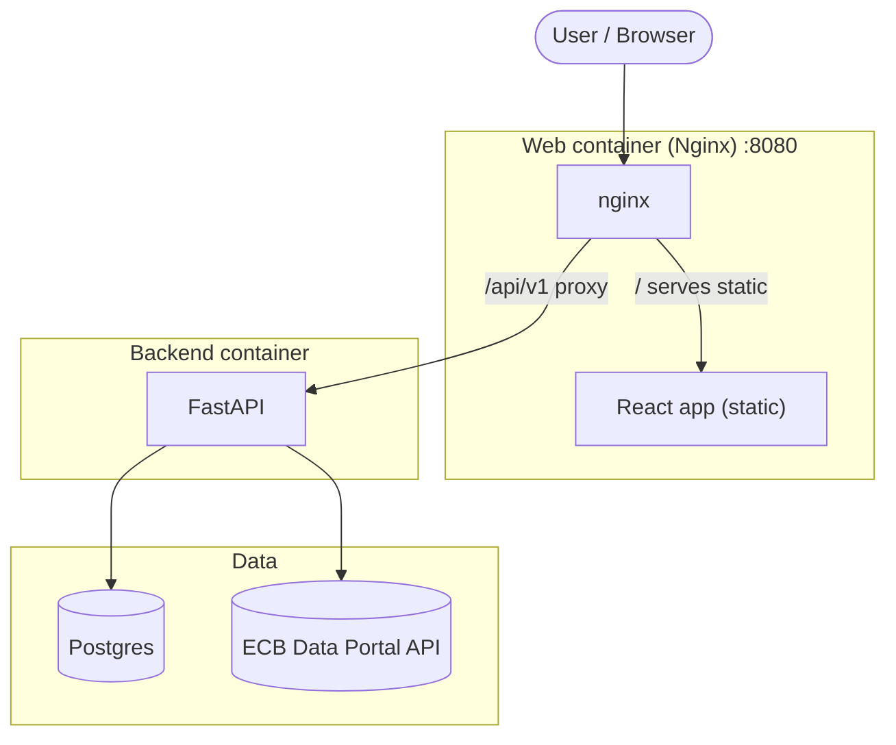

## Cost of borrowing webapp (ECB → Postgres → FastAPI → React/Chart.js)

Collects the ECB series **“Cost of borrowing for households for house purchase, Euro area, Monthly”**, stores it in Postgres, exposes it via a small FastAPI, and displays it as a line chart in a React web page.

### Architecture (Docker Compose)



### Build & run

You need **Docker** (with Compose). From the repo root:

```bash
chmod +x run.sh
./run.sh
```

Open **http://localhost:8080**.

### Creative choices

- **Hexagonal backend (ports & adapters)**: the core use case (`CostOfBorrowingHouseholdsService`) depends on a provider port (`TimeSeriesProvider`) and a repository, so switching the ECB source or persistence strategy is isolated to adapters.
- **ECB provider behind an interface**: we use the ECB Data Portal JSON endpoint (the same one powering their charts) behind `EcbPortalProvider`, to keep the HTTP/parsing concerns out of the service layer.
- **Nginx as the single entrypoint**: the browser only talks to Nginx (`/` for the React app, `/api/v1/*` proxied to FastAPI). This avoids CORS complexity and mirrors a common production setup.
- **Tests at two levels**:
  - Unit tests: provider parsing/mocked fetch and service orchestration (no DB, no network).
  - Integration/E2E: Docker Compose stack tested through Nginx, hitting the real API endpoints.

### Technologies

| Layer | Stack |
|---|---|
| **Backend** | Python 3.12, FastAPI, Uvicorn, SQLAlchemy, Psycopg, httpx |
| **Database** | Postgres 16 |
| **Frontend** | React, Vite, TypeScript, Tailwind CSS, Chart.js + react-chartjs-2 |
| **Run** | Docker Compose; frontend served by nginx (multi-stage build), proxying `/api/v1` to the backend |

### API

All endpoints are versioned under `/api/v1` and are reachable through Nginx:

- **Health**

```bash
curl -i http://localhost:8080/api/v1/health
```

- **Ingest from ECB into Postgres**

```bash
curl -sS -X POST http://localhost:8080/api/v1/ingest
```

- **Read observations**

```bash
curl -sS "http://localhost:8080/api/v1/observations?start=2022-01-01&end=2026-01-01" | head
```

### Tests

Run the unit tests inside Docker:

```bash
docker compose up --build -d backend
docker compose exec -T backend pytest -q
```

#### Integration/E2E (Docker Compose)

With the app running (or in CI), the E2E script validates the stack through Nginx:

```bash
python3 backend/tests/e2e.py
```


